# AgroTrack – Tarım Takip ve Danışmanlık Mobil Uygulaması

Bu proje, üniversite ikinci zorunlu yaz stajım kapsamında geliştirdiğim **üçüncü projedir** ve **8 gün içerisinde** tamamlanmıştır. Uygulamanın amacı, çiftçilerin günlük tarımsal faaliyetlerini dijital ortamda daha düzenli ve verimli bir şekilde yürütebilmelerine yardımcı olmaktır.

---

## Proje Açıklaması

AgroTrack, çiftçilerin mahsul takibi yapmasını, hava durumunu kontrol etmesini, yatırım kategorilerine göre yeni mahsuller keşfetmesini ve yapay zeka destekli öneriler almasını sağlayan mobil tabanlı bir platformdur. Uygulama, **Clomosy** platformu üzerinde geliştirilmiş olup **SQLite** veritabanı kullanmaktadır.

---

## 1. Giriş (Login) ve Yeni Kullanıcı Sayfası

Uygulama, kullanıcıyı ilk olarak AgroTrack’e ait logo ile karşılar. Ardından kullanıcı, modern tasarıma sahip giriş ekranına yönlendirilir. Eğer hesabı yoksa "Yeni Kullanıcı" seçeneği ile kayıt olabilir. Giriş ve kayıt ekranlarında kullanıcı adı/parola doğrulama gibi temel kontroller arka planda yapılır.

  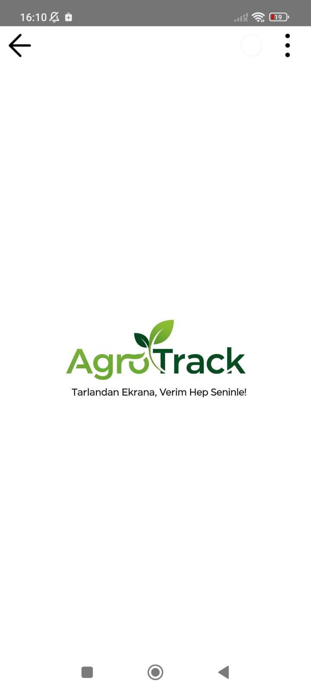
  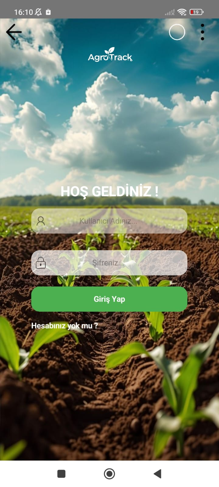
  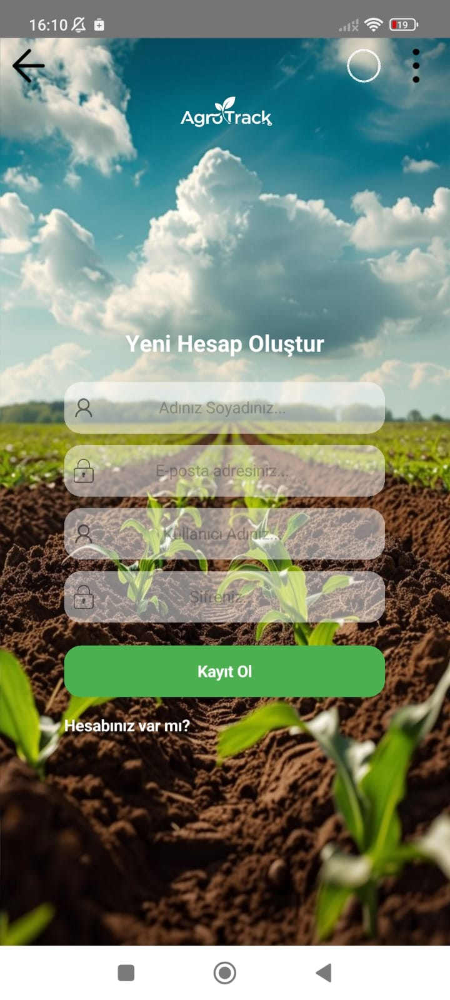

---

## 2. Ana Sayfa – Hava Durumu, Tarım İpucu ve Sohbet

Ana sayfada, lokasyon bazlı hava durumu, her gün değişen tarım ipuçları ve kullanıcının ekili mahsulleri görsel kartlar şeklinde sunulur. Ayrıca, yatırım kategorisine göre önerilen mahsul kartları da burada yer alır.

Gemini API ile entegre edilen yapay zeka destekli sohbet paneli sayesinde kullanıcılar, metin veya görsel göndererek yapay zekadan tarım danışmanlığı alabilir.

  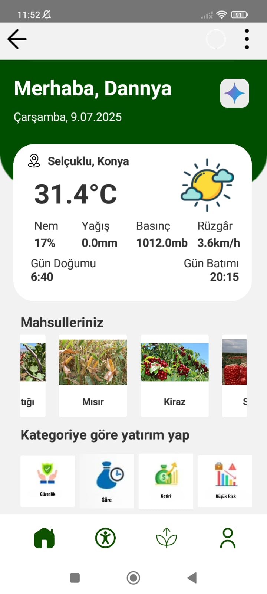
  
  

---

## 3. Yatırım Önerileri Sayfası

Kullanıcı, bu sayfada dört yatırım kategorisinden birini seçebilir: Düşük Risk, Yüksek Getiri, Güvenlik ve Hızlı Yetişen Mahsuller. Seçilen kategoriye göre ekranda önerilen mahsuller, görselli kart formatında detaylı bilgilerle birlikte gösterilir.

  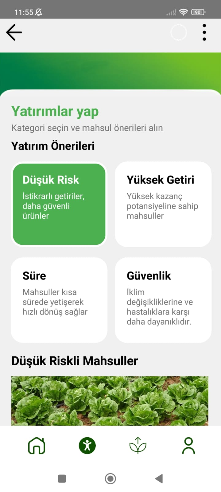
  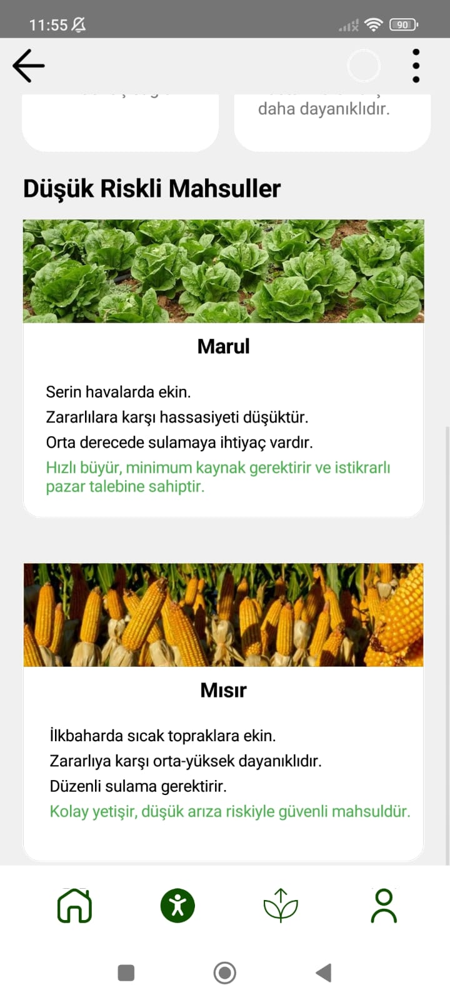
  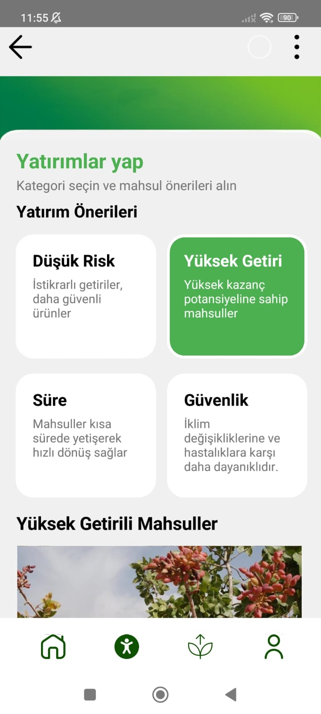
  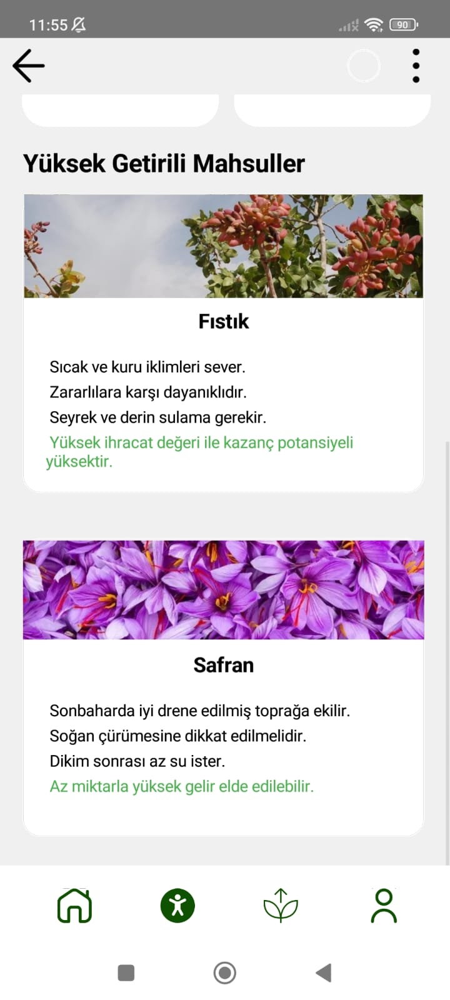
  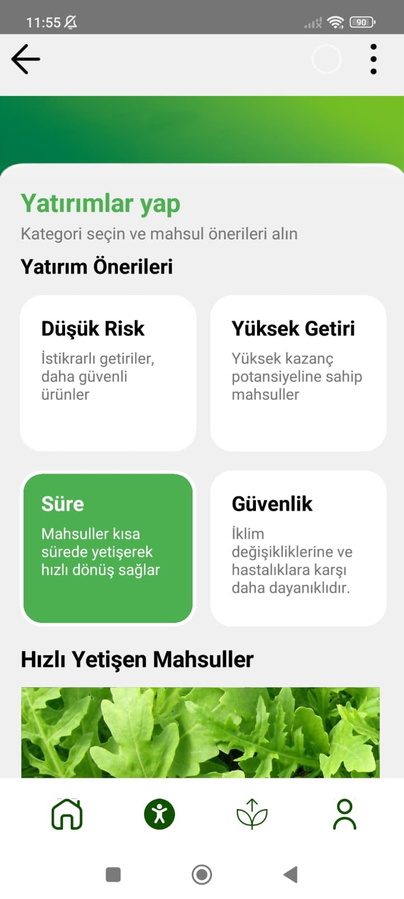

---

## 4. Ekili Mahsullerim Sayfası

Bu sayfa, kullanıcının geçmişte ektiği mahsulleri listelediği alandır. Her mahsul için fotoğraf, ekim tarihi, kullanıcı notları gibi bilgiler yer alır. Yeni mahsul eklerken kullanıcı:
- Kamerayla anında fotoğraf çekebilir,
- Telefona kayıtlı görseli seçebilir,
- Bir görselin URL’sini girebilir.

  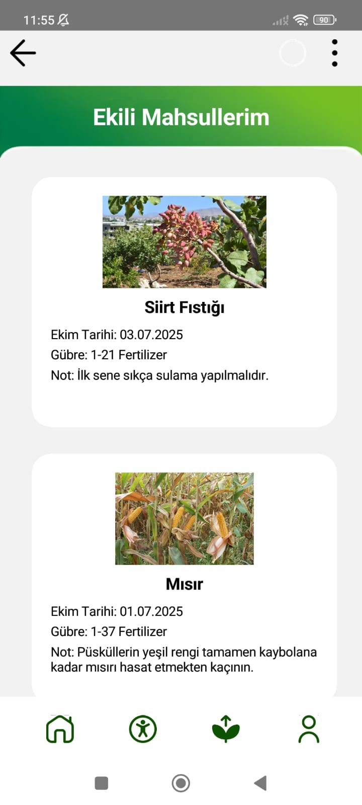
  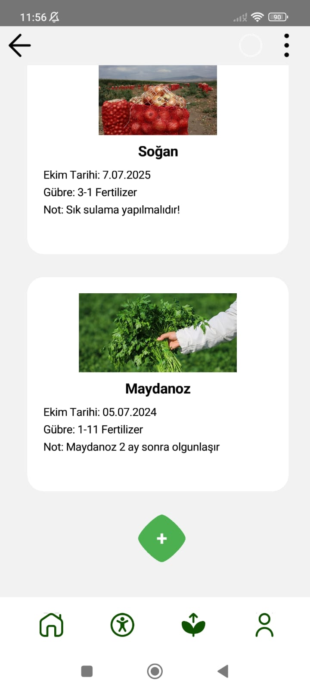
  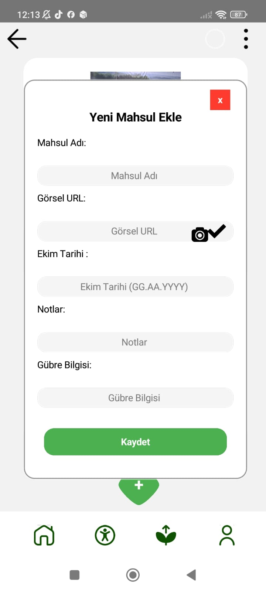
  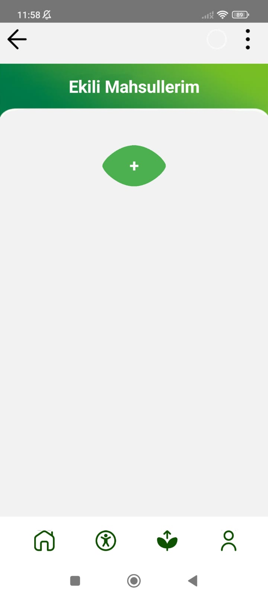

---

## 5. Kullanıcı Profili Sayfası

Kullanıcı adı, tam adı ve e-posta adresinin gösterildiği sade ve anlaşılır bir profil sayfasıdır. Karmaşık tasarım öğeleri içermeyen bu sayfa, kullanıcıya hızlı bilgi sunar.

  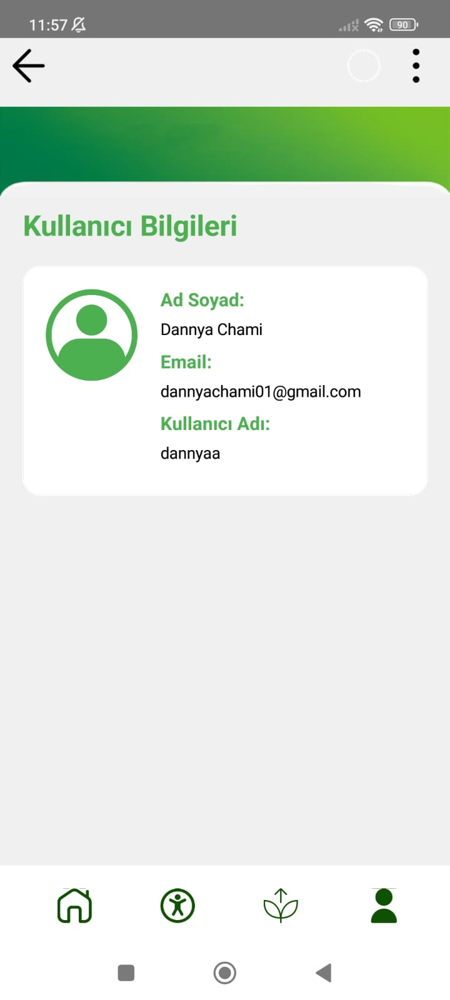

---

## Planlanan Geliştirmeler

- Ekili mahsulleri düzenleme ve silme özellikleri
- Yapay zekaya hastalık ve zararlı tespiti için daha detaylı analiz sistemleri
- Maliyet takibi ve yatırım planlama modülü
- Sohbet paneli için çok dilli destek

---

## Teknik Bilgiler

- **Platform:** Clomosy
- **Veritabanı:** SQLite
- **Yapay Zeka:** Google Gemini API
- **Dil:** TRObject Script (Clomosy'nin görsel kodlama sistemi)

---

## Kullanılan Teknolojiler ve Metotlar

- Clomosy ile mobil uygulama geliştirme
- SQLite veritabanı bağlantısı
- Gemini API entegrasyonu
- Sanal klavye yönetimi (VirtualKeyboard)
- Kart temelli görsel bilgi sunumu
- Timer tabanlı olay kontrolü ve UI güncellemeleri
